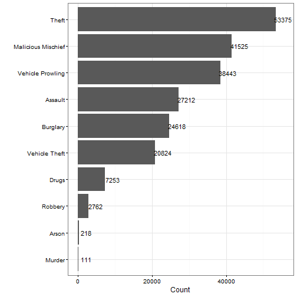

# Reading data


```r
# Arrive at Crime_byNeighborhood using earlier code that was originated by Krisztian
# crimedfonly=data.frame(Crime_byNeighborhood)
# save(crimedfonly,file="Data/Crime_byNeighborhood.Rda")

load("Data/Crime_byNeighborhood.Rda")
str(crimedfonly)
```

```
## 'data.frame':	216341 obs. of  11 variables:
##  $ OFFENSE  : Factor w/ 43 levels "ARSON","ASSAULT-SIMPLE",..: 27 23 23 8 37 37 23 37 37 27 ...
##  $ OFFGEN   : Factor w/ 10 levels "Arson","Assault",..: 8 5 5 2 9 9 5 9 9 8 ...
##  $ BEGINDATE: Factor w/ 3341 levels "2000/01/01","2000/07/14",..: 999 1066 196 198 192 199 200 199 201 201 ...
##  $ ENDDATE  : Factor w/ 3259 levels "2000/12/01","2001/01/01",..: 914 982 112 113 107 115 115 115 116 116 ...
##  $ LOCATION : Factor w/ 12021 levels "0 Block Of E 13Th Av",..: 10784 2688 10290 720 10696 353 5879 9549 965 11116 ...
##  $ Name     : Factor w/ 28 levels "Audubon/Downriver",..: NA NA 16 20 18 16 14 16 6 15 ...
##  $ Lat      : num  NA NA 47.6 47.7 47.7 ...
##  $ Lng      : num  NA NA -117 -117 -117 ...
##  $ coords.x1: num  2477294 2480061 2481088 2464135 2485380 ...
##  $ coords.x2: num  361936 299239 252062 291819 287599 ...
##  $ optional : logi  TRUE TRUE TRUE TRUE TRUE TRUE ...
```

# Calling on a few packages


```r
suppressPackageStartupMessages(library(ggplot2))
suppressPackageStartupMessages(library(dplyr))
suppressPackageStartupMessages(library(lubridate))
```

# Total offenses


```r
crimedfonly %>% group_by(OFFGEN)%>%summarise(Counts=length(OFFGEN))%>% ggplot(.,aes(reorder(OFFGEN,Counts),Counts))+geom_bar(stat="identity")+geom_text(aes(x=OFFGEN,y=Counts+2000,label=Counts))+coord_flip()+theme_bw()+labs(y="Count",x="")
```



# Number of times offenses occured in different neighborhoods


```r
crimedfonly %>% group_by(Name)%>%summarise(Counts=length(Name))%>%filter(Name!="")%>% ggplot(.,aes(reorder(Name,Counts),Counts))+geom_bar(stat="identity")+geom_text(aes(x=Name,y=Counts+1000,label=Counts))+coord_flip()+theme_bw()+labs(y="Count",x="")
```


## Offenses in different neighborhoods


```r
# A shiny app will do well here

crimedfonly %>% group_by(Name,OFFGEN)%>%summarise(Counts=length(OFFGEN))%>%filter(Name!="")%>% ggplot(.,aes(OFFGEN,Counts))+geom_bar(stat="identity")+facet_wrap(~Name,scales="free")
```


## Messing with Dates


```r
# Adds 9 columns to the dataset

crimedfonly=crimedfonly[,1:11]

# Beginning dates parsed

crimedfonly$beginyear=year(ymd(crimedfonly$BEGINDATE))
crimedfonly$beginmonth=month(ymd(crimedfonly$BEGINDATE),label=TRUE)# label parameter inserts name of month instead of number
crimedfonly$begindate=day(ymd(crimedfonly$BEGINDATE)) 
crimedfonly$beginday=wday(ymd(crimedfonly$BEGINDATE)) # label parameter inserts day of week instead of number of the day in a 7-day week

# Ending dates parsed

crimedfonly$endyear=year(ymd(crimedfonly$ENDDATE))
crimedfonly$endmonth=month(ymd(crimedfonly$ENDDATE),label=TRUE)
crimedfonly$enddate=day(ymd(crimedfonly$ENDDATE))
crimedfonly$endday=wday(ymd(crimedfonly$ENDDATE),label=TRUE)

# duration, in days, between starting and ending days
crimedfonly$durationdays= (as.duration(ymd(crimedfonly$ENDDATE)-ymd(crimedfonly$BEGINDATE)))/ddays(1)

head(crimedfonly)
```

```
##              OFFENSE             OFFGEN  BEGINDATE    ENDDATE
## 1              THEFT              Theft 2010/03/12 2010/03/12
## 2 MALICIOUS MISCHIEF Malicious Mischief 2010/05/18 2010/05/19
## 3 MALICIOUS MISCHIEF Malicious Mischief 2007/12/30 2007/12/31
## 4   ASSAULT 4TH/CITY            Assault 2008/01/01 2008/01/01
## 5          VEH-PROWL   Vehicle Prowling 2007/12/26 2007/12/26
## 6          VEH-PROWL   Vehicle Prowling 2008/01/02 2008/01/03
##                       LOCATION               Name      Lat       Lng
## 1       800 Block Of S Thor St               <NA>       NA        NA
## 2   1800 Block Of W Gardner Av               <NA>       NA        NA
## 3       700 Block Of W 17Th Av Manito/Cannon Hill 47.63393 -117.4179
## 4 10200 Block Of N Seminole Dr North Indian Trail 47.74563 -117.4911
## 5  800 Block Of E Magnesium Rd  Nevada/Lidgerwood 47.71833 -117.3989
## 6       100 Block Of W 17Th Av Manito/Cannon Hill 47.63393 -117.4179
##   coords.x1 coords.x2 optional beginyear beginmonth begindate beginday
## 1   2477294    361936     TRUE      2010        Mar        12        6
## 2   2480061    299239     TRUE      2010        May        18        3
## 3   2481088    252062     TRUE      2007        Dec        30        1
## 4   2464135    291819     TRUE      2008        Jan         1        3
## 5   2485380    287599     TRUE      2007        Dec        26        4
## 6   2483348    252177     TRUE      2008        Jan         2        4
##   endyear endmonth enddate endday durationdays
## 1    2010      Mar      12    Fri            0
## 2    2010      May      19    Wed            1
## 3    2007      Dec      31    Mon            1
## 4    2008      Jan       1   Tues            0
## 5    2007      Dec      26    Wed            0
## 6    2008      Jan       3  Thurs            1
```


# Few low hanging fruits to pick next


* plots of trends for years, months, weeks, days, offense types
* mapping stuff by different variables


